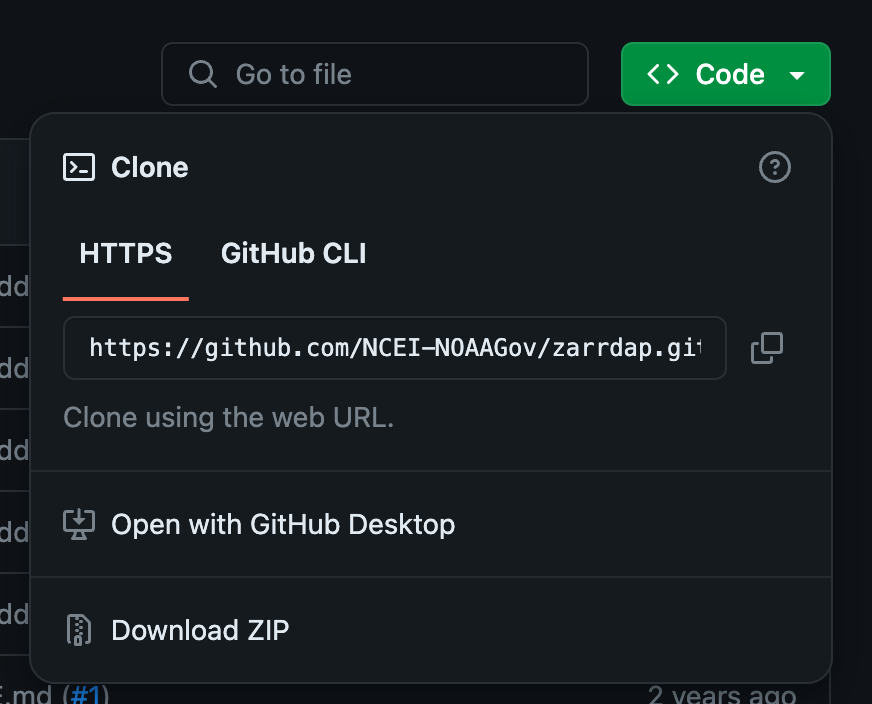

# Collection of Jupyter Notebooks for accessing datasets at NOAA's National Center for Environmental Information (NCEI)

Jupyter Notebooks have become one of the standards for experimenting in data science. These notebooks are powered by [Jupyter.org](https://jupyter.org/) which claims Free software, open standards, and web services for interactive computing across all programming languages.

## Programming Languages

Many of the notebooks that will be found in this repository will be written in Python, although additional langagues will be added as the project continues to develop.

## Purpose of the Jupyter Notebooks
The notebooks in this section are designed to get users up and running on a dataset as quickly as possible. This should include connection to public data for the given dataset.

---

## Structure of the project

The project will be broken into folders by dataset. An example would be for the Global Historical Climatology Network-hourly (GHCNh) dataset:

- The specific folder in this project for the GHCNh dataset would match the shortname for the dataset:
    - /GHCNh

- In this folder will be the notebooks for this dataset that have been prepared. Each notebook will be named as follows:

    - **dataset-shortname**-**notebook_information**-**programming-language**

- Which results in the following example file for GHCNh:

    - GHCNh/ghcnh-basic_connection-python.ipynb

---

## Installing Jupyter Notebooks

The best source for installing Jupyter Notebooks to begin experimenting with features is the installation portion of Jupyter's website:

[https://jupyter.org/install](https://jupyter.org/install)

Follow the instruction provided to get your notebook instance installed on your machine. Once installed you can clone this repository to begin experimenting.

## Cloning the repository

Cloning the repository allows the files located in a given repository to be copied to your machine.

### To clone this repository

The **git clone** command is used to begin this process. To get the 

An example command for another repository would be:

- git clone https://github.com/NCEI-NOAAGov/zarrdap.git

Replace with the repository link for your project.
